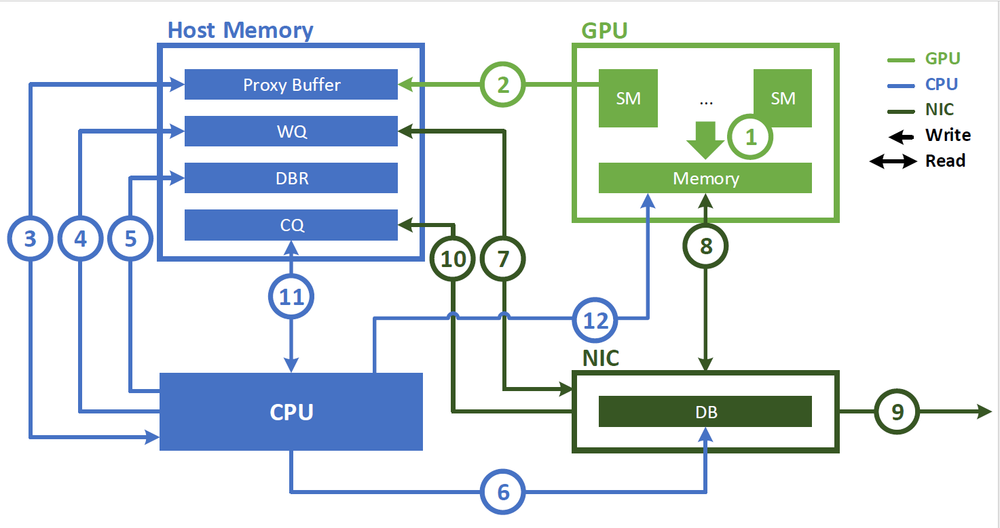
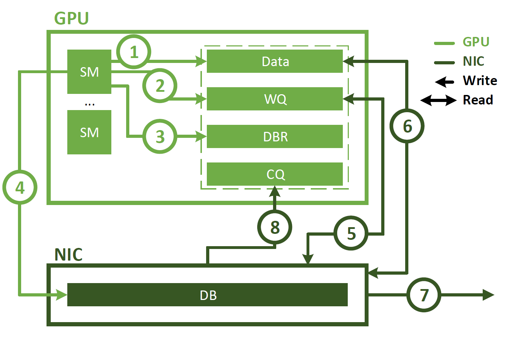

为了计算NVSHMEM基于IBRC和IBGDA的AllToAll集合通信的理论耗时，采用LogGP模型来进行分析。

# LogGP模型简介

LogGP的五个参数：

- L（Latency）:通信延迟，表示从消息发送到消息接收所需的时间
- o（Overhead）:在发送端和接收端处理消息时产生的开销
- g（Gap）：消息之间的最小时间间隔，反映网络的带宽限制
- G（Gap per byte）：表示每个字节传输的时间开销，用来描述大消息的传输情况
- P（Processors）：处理器的数量
- n 是消息的总大小（字节数）

LogGP模型的通信延迟公式为：


$$
T=L+2\times{o}+\frac{n}{G}
$$


# NVSHMEM的AllToAll Kernel

本次分析主要聚焦于IBGDA和IBRC，因此对AllToAll中有关NvLink、P2P等相关的优化暂时忽略。

`nvshmemi_call_alltoall_on_stream_kernel`在launch Kernel时，设置num_blocks为1，因此AllToAll Kernel只有一个Block，在一个SM上执行。

```
alltoall_on_stream_kernel<TYPE><<<num_blocks, num_threads_per_block, 0, stream>>>(
        team, dest, source, nelems, in_cuda_graph);
```

`nvshmemi_alltoall_allpush_threadgroup`在执行时，通过for循环，使得Block中的每一个thread都负责将对集合通信中的其他PE执行PUT操作。最终确保了所有PE之间AllToAll的成功实现。该函数的每一个thread会调用：

```c++
nvshmemi_transfer_put_signal<NVSHMEMI_THREADGROUP_THREAD>
```

在启用IBGDA时，该函数内部调用`nvshmemi_ibgda_put_signal`，否则使用IBRC，调用`nvshmemi_proxy_rma_nbi`。

对于`nvshmemi_ibgda_put_signal`而言，其内部包括Thread和WARP/BLOCK两种实现方法，不过在该Kernel下，指定了其采用Thread的方法，即`nvshmemi_ibgda_put_signal_thread_impl`。

**两者的核心差异：**

**IBRC**：GPU将通信请求放入指令队列，由一个单线程的CPU Proxy负责读取、解析指令，并最终利用指令中的信息调用网络库完成通信。

**IBGDA**：GPU Kernel自己构造WQE，并通过内存映射直接将WQE发送到网卡的指令队列，中间完全绕过了CPU。

# IBRC



在IBRC中，最终与网络驱动交互、发起通信的处理器是CPU，其利用CPU Proxy不断处理GPU发来的传输指令。因此，对于IBRC来说：

- L：不变，由物理网络决定
- o：开销很大，包括了GPU写指令、CPU代理读取并解析指令、调用网络库函数、CPU代理轮询完成队列、处理完成事件、更新状态等
- G：由网络物理带宽决定

AllToAll操作需要每个PE向其他P-1个PE发送消息，每次传输的数据总大小为n。由于CPU代理的串行瓶颈，它必须一个接一个处理P-1个发送请求。


$$
T_{IBRC} \approx L+2\times o_{IBRC}+\frac{M}{G}
$$


其中，


$$
M=(P-1) \times n
$$


## IBRC各步骤耗时

1. GPU端进行指令的生成与提交（\(T_{GPU}\(）

   GPU Kernel中transfer_dma所做的工作，包括：
   
   - 通过atomicAdd在环形队列中预留空间
   - 执行check_channel_availability进行流控，请求过多时可能会导致等待
   - 利用位运算，将PUT操作的详细信息（如远程地址的roffset、操作类型、group_size、标志位flag、laddr、size等），注意构建了4个8字节的指令包
   - 通过volatile 64位内存写入，将指令包传给环形队列
   
   该部分耗时主要在GPU上的原子操作、内存读写以及可能的自旋等待组成，在环形队列未满时，耗时较短且相对固定。
   
   
   $$
   T_{GPU}=T_{atomicAdd}+T_{flowControl}+T_{buildPackets}
   $$
   
   
2. GPU与CPU的切换，包括通信延迟与唤醒延迟（$T_{syncWakeup}$）

   - GPU需要通过__threadfence()确保其写入的指令对CPU可见，且GPU需要通过PCIE向主机内存中写入指令
   - 内核调度器唤醒CPU Proxy，涉及到一次上下文切换

   
   $$
   T_{syncWakeup}=T_{GPUFence}+T_{PCIe}+T_{shedule}
   $$
   

3. CPU端指令处理（$T_{CPUproxy}$）

   CPU Proxy中process_channel_dma函数所做的工作

   - 读取并等待上面四个指令，其中会用到__sync_synchronize()这个内存栅栏，有较大的时间开销。在这一阶段能够重组获得laddr、size、pe、op、rptr
   - 之后提交传输操作，通过nvshmemi_process_multisend_rma执行具体的网络传输

   该部分耗时主要是同步开销。

   
   $$
   T_{CPUproxy}=T_{spinWait}+T_{CPUfence}
   $$
   

4. 网络传输（$T_{Network}$） 

   这部分由`nvshmemi_process_multisend_rma` 函数及其调用的底层网络库（如 `libibverbs`）所做的工作。

   - 进行内存注册，获取内存密钥lkey/rkey
   - 根据数据大小决定是否进行数据分块
   - 调用网络库API，由库函数创建WQE
   - Ringing the Doorbell，启动DMA传输

   该部分即LogGP的主体部分

   
   $$
   T_{Network}=T_{lib}+L+\frac{M}{G}
   $$
   

   其中$T_{lib}$是调用网络库函数的开销

因此，对于小消息而言，其总延迟有很大程度上受到前三个阶段的影响，特别是CPU Proxy对于指令的串行执行与上下文切换，导致其瓶颈主要在CPU端，带宽难以充分利用。而大消息因其单次指令传输数据大，主要瓶颈在带宽方面，故其对带宽的利用率较高，与IBGDA类似。

# IBGDA



基于IBGDA的AllToAll Kernel在实现上调用`nvshmemi_ibgda_put_signal_thread_impl`，该方法依据NVSHMEMI_THREADGROUP_THREAD级别进行指令的发送。

## Thread

1. 该线程独自调用ibgda_get_qp()获取与目标PE通信的QP，调用ibgda_get_lkey/ibgda_raddr_rkey获取本地和远程内存的内存密钥，并确定这些密钥能覆盖的最大数据范围
2. 根据传输的数据量和密钥的覆盖范围，决定是采取方案1还是方案2。
   - 方案1：当全部数据可以一次性完整传输时，调用ibgda_reserve_wqe_slots在网卡命令队列中预留所需的所有WQE槽位，并依次写入PUT和Signal的WQE，最后调用ibgda_submit_requests通知网卡开始工作。
   - 方案2：当数据总量超过了单次传输上限时，对数据进行分块，通过循环，按照“获取当前块密钥、预留WQE、写入WQE、提交”的顺序执行，直到将所有数据块都传输完毕。
3. 如果不是非阻塞式的，则调用ibgda_quiet，等待网卡确认所有任务完成，GPU不断轮询CQ来判断传输是否完成。

在IBGDA中，发起通信的处理器是GPU，由其SM直接向NIC发送指令。

- L：不变，由物理网络决定

- o：比较低，发送开销仅包括GPU构造几条指令来构建WQE，并”按响门铃“（一次MMIO写操作）的时间。

- G：同样由网络物理带宽决定

  

$$
T_{IBGDA} \approx L+2\times o_{IBGDA}+\frac{M}{G}
$$


其中，


$$
M=(P-1) \times n
$$

## IBGDA各步骤耗时

IBRC在执行传输时，GPU需要向CPU Proxy发送特定地指令，让CPU Proxy解析指令获得构造wqe的信息。而IBGDA跳过了这一系列步骤，由GPU直接生成wqe，并将其写入网卡。由于GPU是SIMT的编程模型，单个warp内的多个thread可以同时向网卡写入wqe，因此避免了小消息时，带宽利用不充分的问题。
